# Writeup: Building a Controller #

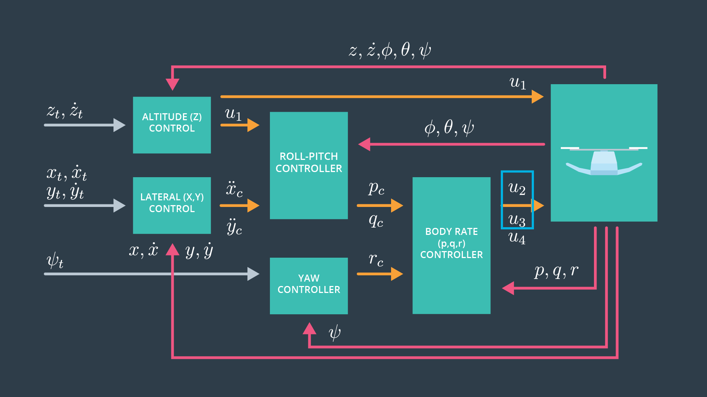

## Implemented Controller

### Implemented body rate control  

I completed the `QuadControl::BodyRateControl` method 
to implement this functionality.
Also, I configured a value for the angle rate gain parameter (`kpPQR`)
in the `QuadControlParams.txt` file.

This P-controller produces desired moments for the
roll, pitch, and yaw axes.
My implementation is based on the following expression:

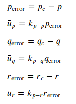

Here, up, uq, and ur are 
rotational accelerations along each axis.

### Implement roll pitch control 

I completed the `QuadControl::RollPitchControl` method
to implement this functionality.
Also, I configured a value for the roll/pitch gain parameter (`kpBank`)
in the `QuadControlParams.txt` file.

This P-controller produces pitch rate (qc) and roll rate (pc) .
My implementation is based on the following expression:

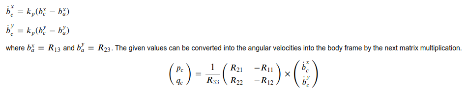

The variable `desiredRollRate` inside the method stores
the calculated value of pc, and the `desiredPitchRate`
stores the value of qc.

### Implement altitude controller 

I completed the `QuadControl::AltitudeControl` method
to implement this functionality.
Also, I configured values for gain parameter (`kpPosZ`, `KiPosZ`, and `kpVelZ`)
in the `QuadControlParams.txt` file.

This PID-controller produces  a collective thrust command.
My implementation is based on the following expression:

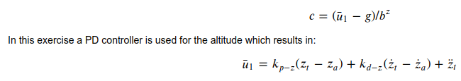

Here, ul controls vertical acceleration.
The variable `desiredAcceleration` inside the method stores
the calculated value of first ul and later
of c.

### Implement lateral position control 

I completed the `QuadControl::LateralPositionControl` method
to implement this functionality.
Also, I configured values for gain parameter (`kpPosXY` and `kpVelXY`)
in the `QuadControlParams.txt` file.

This PD-controller produces the desired horizontal
accelerations.
For the x direction, my implementation is based on the 
following expression:

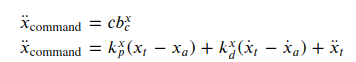

We use an analogous expression for the y direction.

### Implement yaw control 
I completed the `QuadControl::YawControl` method
to implement this functionality.
Also, I configured a value for the yaw control gain parameter (`kpYaw`)
in the `QuadControlParams.txt` file.

This P-controller produces the desired yaw rate (rc).
My implementation is based on the following expression:

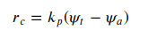

The variable `desiredYawRate` inside the method stores
the calculated value of rc.

### Calculating the motor commands

I completed the `QuadControl::GenerateMotorCommands` method
to implement this functionality.

This function produces a motor command for each motor.
My implementation is based on the following expressions:

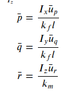

And

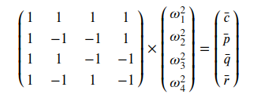

## Flight Evaluation

### Scenario 1: Introduction  

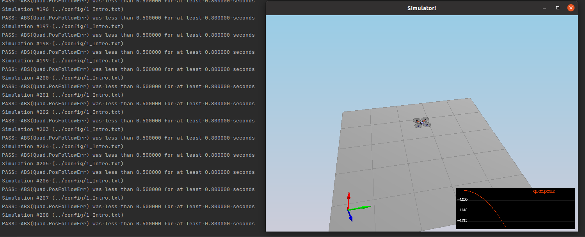

### Scenario 2: Body rate and roll/pitch control  

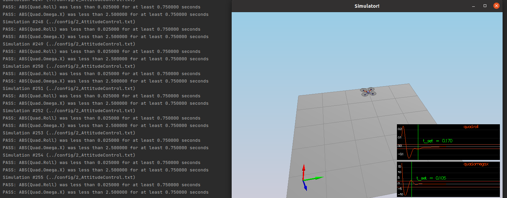

### Scenario 3: Position/velocity and yaw angle control

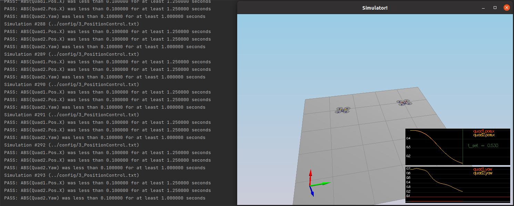

### Scenario 4: Non-idealities and robustness   

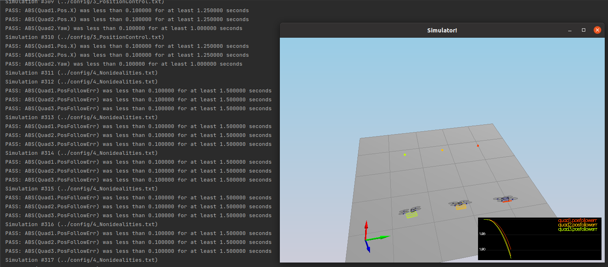
